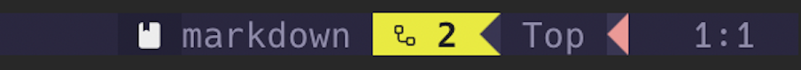

# Git Needy

`git-needy.nvim` is a plugin that automatically keeps a tally of workflows that need to be reviewed in your statusbar.



### Table of Contents

- [Purpose](#purpose)
- [Features](#features)
  - [Lualine](#lualine-integration)
  - [Popup](#pending-workflow-visualizer)
  - [Watch Repos](#persistent-repo-watching)
- [Installation](#installation)
  - [Base](#base-installation)
  - [Status Bar](#status-bar-installation)
    - [lualine](#lualine)
    - [other](#other)
- [Configuration](#configuration)


## Purpose

Have you ever been hassled by a fellow employee to approve a Github workflow run?

Maybe you kicked off a long running workflow, then started working on something else and forgot to "Approve" the final job in the sequence.

Perhaps you just want to be a good employee and quickly approve workflows.

Good news! **git-needy** is here to solve that! With this plugin, you can have a visualizer that sits in your lualine (or similar status line plugin) that will display the amount of pending workflows in your repositories, changing color based on how many there are.

It also easily lets you navigate directly to Github to approve the workflows.

## Features

#### lualine Integration


By default, the section will display the amount of pending workflows with a color-coded background. It will be green for 0 pending workflows, yellow for 1 or 2 pending workflows, orange for 3 or 4, and red for 5 or more. To see how to easily navigate to them, see below.

By default, we include `waiting` workflows in addition to `pending`. The reasoning is that the ones `waiting` are waiting on the `pending` ones, so it will show you the total amount of Github workflows that are essentially "backed up" as a result of you not approving workflows.


#### Pending Workflow Visualizer


Simply run `:GitNeedyOpen` to open a window to view pending workflows (and workflows waiting for them), press `Enter` on the workflow you want to view, and it will open the approval page in your browser. Then after a very thorough investation, you can approve it in your browser. To exit this window, press `q`.

#### Persistent Repo Watching

By default, it will check the current repository you are in, as well as any repositorys defined in the `repos` section of the config, in case you are an admin on one of them and need to persistently watch it.

## Installation

**NOTE** for this plugin to work you need to have either `GITHUB_TOKEN` or `GH_TOKEN` in your environment with permissions to view workflows in the appropriate repositories.

#### Base Installation

To install with `lazy.nvim`, do this

```lua
{
  "cd-4/git-needy.nvim",
  config = function()
    require("git-needy").setup({
      repos = {"my-repo-i-watch", "another-repo"}
      vim.keymap.set("n", "<leader>wf", vim.cmd.GitNeedyOpen),
    })
  end,
},
```

#### Status Bar Installation

##### Lualine

To add this to your lualine, you can do something like this

```lua
  local pending_workflows = require("git-needy").get_lualine_section()

  require("lualine").setup({
    sections = {
      lualine_a = { "mode" },
      lualine_b = { "branch", "diff" },
      lualine_c = { "filename" },
      lualine_x = { "lsp_status", "filetype", pending_workflows }, -- This is where we add it
      lualine_y = { "progress" },
      lualine_z = { "location" },
    },
  })
```

##### Other

If you use a different status line plugin, you can still likely customize it to make use of this functionality using the following functions:

```lua
  -- Returns default text (with icon)
  require("git-needy").get_pending_text()

  -- Returns number of pending workflows
  require("git-needy").get_pending_count()

  --[[
  Returns colors in the form of:
    {
      -- foreground
      fg = "#abcdef",
      -- background
      bg = "#123456",
      -- style
      gui = "bold",
    }
  --]]
  require("git-needy").get_colors()

```

## Configuration

`git-needy.vim` supports several configuration options.

```lua
require("git-needy").setup({
  -- How long to wait (in seconds) before re-querying for workflows
  refresh_seconds = 60,
  -- Whether or not to check the current repository
  use_current = true,
  -- Repos to always query for (RECOMMENDED)
  repos = {},
  -- Github workflow statuses to watch for
  statuses = { "pending", "waiting" },
  -- Icon to display next to the number of pending workflows
  icon = "",
  -- Severity limits that will change color of text
  severity_limits = {
    low = 0,
    med = 2,
    high = 4,
  },
  -- Colors of the lualine icon
  colors = {
    -- Background Colors
    bg = {
      none = "#00820d",
      low = "#e8eb42",
      med = "#db8412",
      high = "#b8361c",
    },
    -- Foreground Colors
    fg = {
      none = "#dddddd",
      low = "#222222",
      med = "#222222",
      high = "#dddddd",
    },
  },
})
```

## Other

There is a way to approve a workflow just by hitting a URL, but I feel like just seeing a notification and approving it without looking further into it defeats the entire purpose of the approval process, so I chose not to implement that feature.

